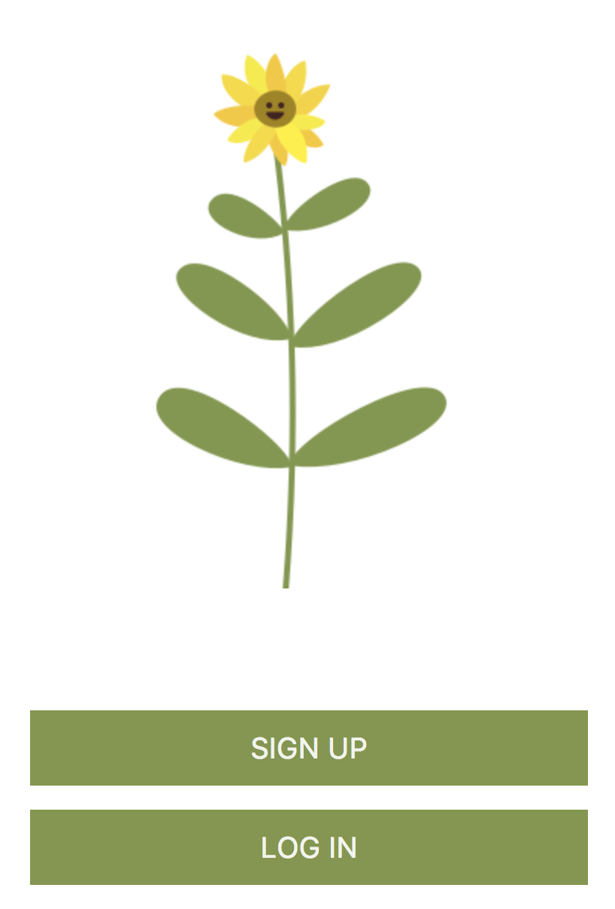
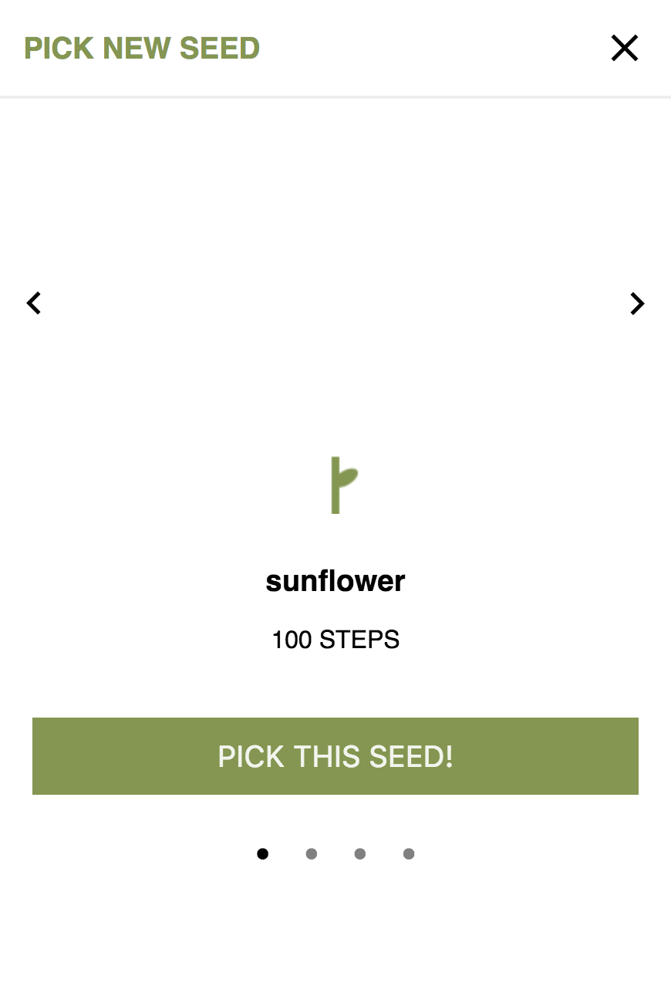
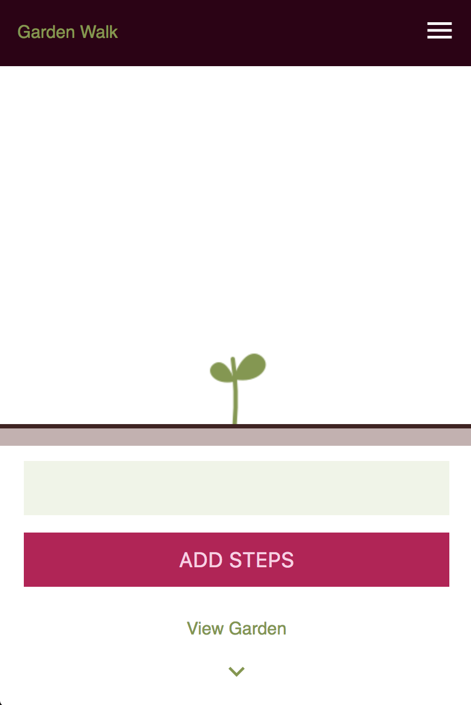
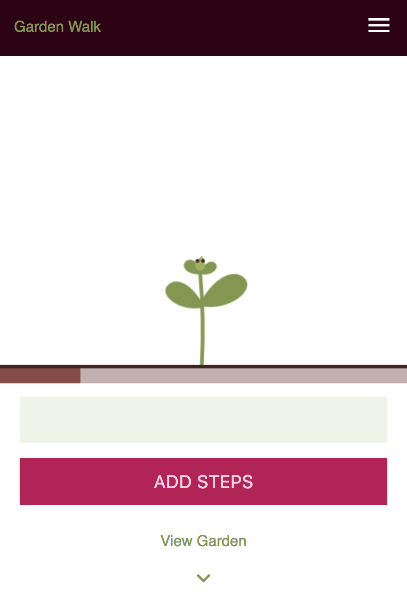
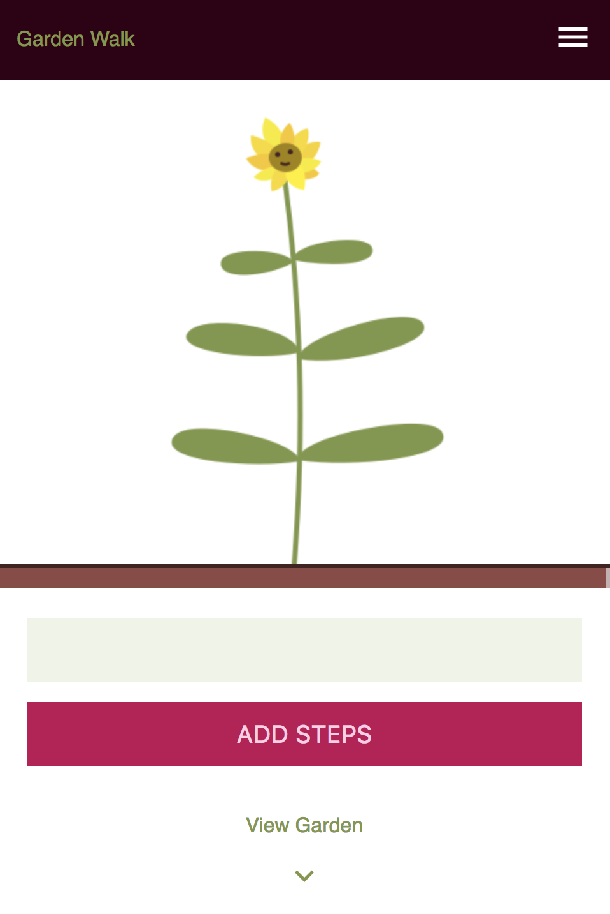
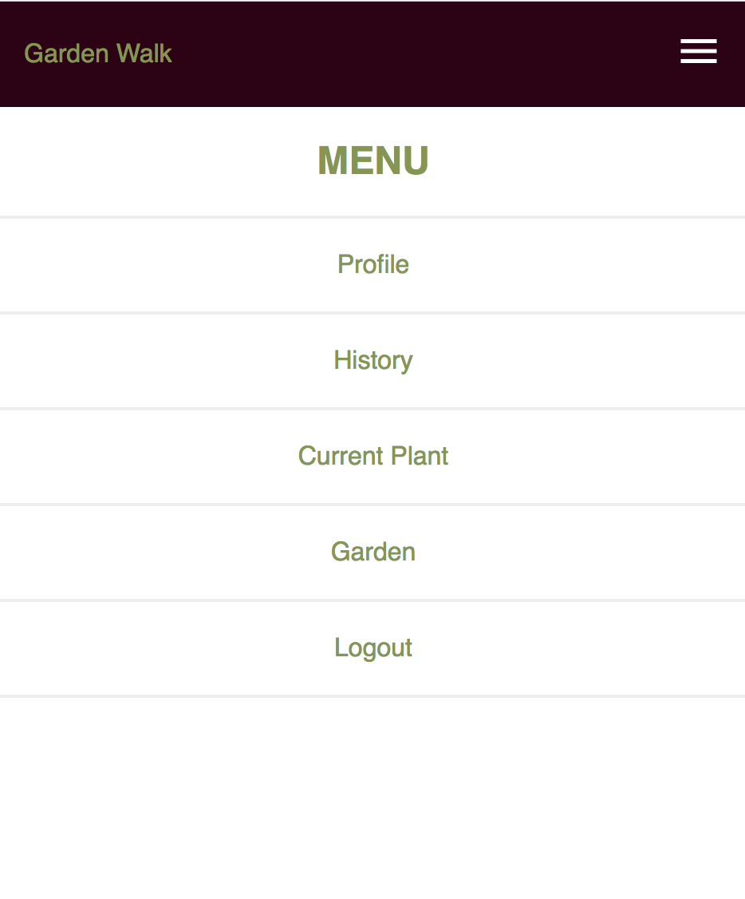
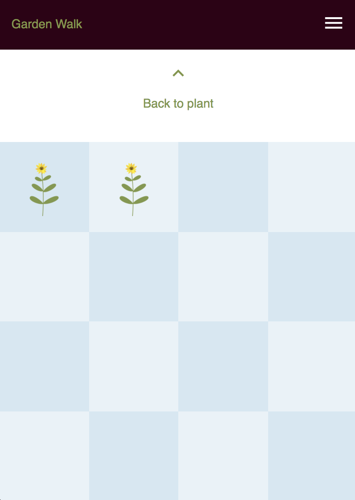

# Garden Walk
<kbd>
  
</kbd>

## LINKS  
### Group Members:  
[Rebecca Jensen](https://github.com/TalusRocks)  
[Sean Obringer](https://github.com/GuitarOTronic)  
[Kat Reinhart](https://github.com/katreinhart)  

### Repos and URLs:  
[Deployed site](https://garden-walk.surge.sh)   
[Frontend repo](https://github.com/TalusRocks/plant-walking-frontend)  
[Heroku app](https://secure-reaches-21432.herokuapp.com/api/plant-instances)  
[Backend repo](https://github.com/TalusRocks/plant-walking-backend)  

## ABOUT  
Kat, Rebecca, and Sean created Garden Walk as a Quarter 3 project for Galvanize's Full Stack Web Development program. Our goals were to both learn React and motivate people to walk more by rewarding users with an adorable garden they could grow with their steps.  

### Pick a seed:
<kbd>
  
</kbd>

## USER STORIES  
As a user, I can...  
-Sign up and log in (and log out)  
-Pick a plant to grow  
-Input steps and see a plant grow in proportion to my steps  
-View my garden, which is a collection of plants I've grown  
-View my history of step inputs  
-Update my profile  

### A new plant:
<kbd>
  
</kbd>

### A growing plant:
<kbd>
  
</kbd>

### An almost-fully-grown plant:
<kbd>
  
</kbd>

## NEXT STEPS
Currently, users must input their steps to make the plant grow. Our vision for this web app is to connect it to a pedometer API so that steps are added automatically.  

This web app is also ripe for social sharing. We'd like to make it easy for users to share their plants with friends.  

User authorization is also in need of additional validation checks.

### Menu:
<kbd>
  
</kbd>

## BUILT WITH
-HTML5, CSS3  \
-JavaScript  \
-React.js  \
-React Router  \
-Node.js, Express.js, Knex.js  \
-PostgreSQL  

### Menu:
<kbd>
  
</kbd>

## INSTALLATION
To run this locally:
1. Clone both the frontend and backend
2. Install npm packages, `npm install`
3. Start both front and backend servers, `npm start`
